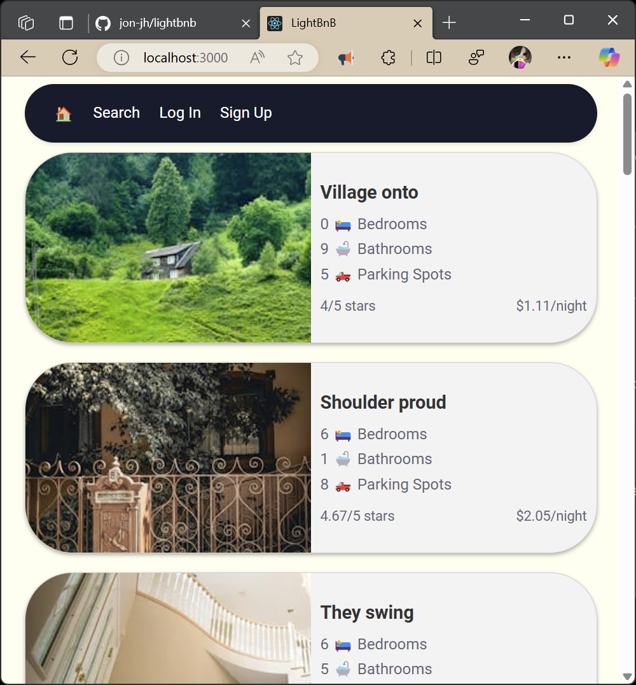

## An AirBnB clone designed to manage property rentals.

## Users can:
- Create an account
- Log in
- Log out
- List properties for rent
- See their reservations
- Filter/search properties
- Add a new listing (does not appear under 'My Listings' at this point since it does not contain a rating)
## Setup Instructions
Please use `npm i` from the root folder to install the dependencies, then `npm start local` to start the server (localhost:3000 by default).